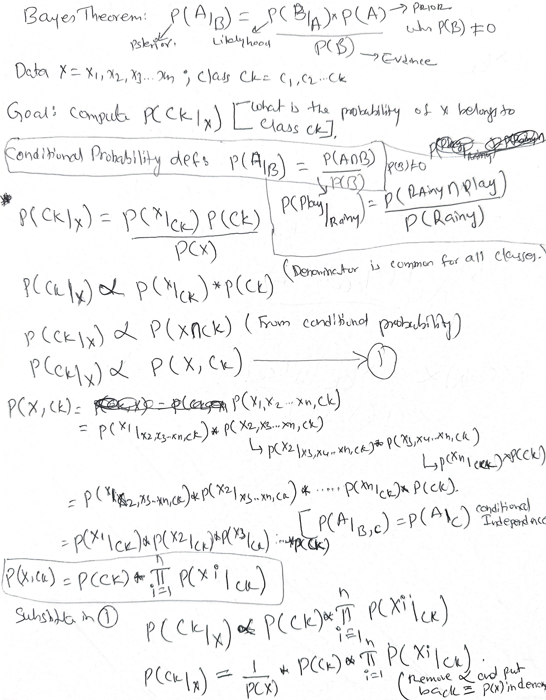

# Naive Bayes — Interview Notes

## 1. Probability Foundations

### Conditional Probability
P(A|B) = P(A ∩ B) / P(B), where P(B) ≠ 0

### Independent Events
Outcome of one event does not affect the other/does not change the likelihood of the other.
- P(A|B) = P(A) and P(A ∩ B) = P(A) · P(B)
- Why a Single Coin Toss is Not Independent:
  -  Before you toss: The probability of getting Tails is 50%.
  -  After you toss: Imagine the coin lands and you see it is Heads.
  -  The shift: Because it is Heads, the probability of it being Tails instantly drops from 50% to 0%.
  -  Examples of Independent Events:Tossing a coin multiple times,Drawing cards with replacement.(first draw ace replace then second draw)

### Mutually Exclusive Events
Events that cannot occur together:
- P(A ∩ B) = 0, so P(A|B) = P(B|A) = 0

> ⚠️ **Common confusion:** Mutually exclusive ≠ independent. In fact, two mutually
> exclusive events with nonzero probabilities are always **dependent** — if one
> happens, you know the other did not.

### Bayes Theorem
P(A|B) = P(B|A) · P(A) / P(B), where P(B) ≠ 0

---

## 2. Problem Setup

- Data point: **x = (x1, x2, …, xn)** with n features/dimensions
- Class labels: **C1, C2, …, Ck**
- Goal: compute **P(Ck | x)** for every class and assign x to the class with the
  highest posterior probability.

By Bayes theorem:

```
P(Ck|X) = P(X|Ck) · P(Ck) / P(X)

Posterior = (Likelihood × Prior) / Evidence
```

- P(Ck) — **prior** (fraction of training points in class k)
- P(X|Ck) — **likelihood**
- P(X) — **evidence**; constant across classes, so it can be dropped when comparing:

```
P(Ck|X) ∝ P(Ck, X)          ……(1)
```

P(Ck, X) is the **joint probability** of class Ck and point x occurring together.

---

## 3. Derivation



Expand the joint probability with the **chain rule** of conditional probability:

```
P(Ck, x1, …, xn)
  = P(x1 | x2, …, xn, Ck) · P(x2 | x3, …, xn, Ck) · … · P(xn-1 | xn, Ck) · P(xn | Ck) · P(Ck)
```

### The "Naive" Conditional Independence Assumption
Assume every feature xi is **conditionally independent** of every other feature,
given the class:

```
P(xi | xi+1, …, xn, Ck) = P(xi | Ck)
```

(Recall: A is conditionally independent of B given C when P(A|B,C) = P(A|C).)

This collapses the chain to:

```
P(Ck, X) = P(Ck) · ∏(i=1 to n) P(xi | Ck)
```

Substituting back into (1), with the evidence reintroduced as normalizer Z = P(X):

```
P(Ck|X) = (1/Z) · P(Ck) · ∏(i=1 to n) P(xi | Ck)
```

### Decision Rule — MAP (Maximum A Posteriori)
Pick the class with the largest posterior:

```
ŷ = argmax over k ∈ {1,…,K} of  P(Ck) · ∏(i=1 to n) P(xi | Ck)
```

> Final probability = prior of the class × product of feature likelihoods given
> that class. This is why NB is called a **generative** model — it models the joint
> distribution P(Ck, X), unlike discriminative models (e.g. logistic regression)
> that model P(Ck|X) directly. **Classic interview question.**
>
-Logistic Regression doesn't care how the data was generated; it skips straight to predicting the boundary (P(C_k|X) given the inputs. Naive Bayes, on the other hand, models the full physics of the dataset (P(C_k, X) by looking at the prior and the likelihoods, allowing it to understand the complete data-generating process

### Why "Naive"?
Features are almost never truly independent in real data (e.g. the words
"machine" and "learning" co-occur), yet NB still works surprisingly well because
classification only needs the argmax to be right, not the probabilities themselves.

---

## 4. Worked Example — Spam Filter (Multinomial NB)
*(Based on StatQuest: "Naive Bayes, Clearly Explained!!!" by Josh Starmer)*

### Training Data
We received **8 Normal** messages and **4 Spam** messages. Counting how often each
word appears in each pile (a histogram per class):

| Word | Count in Normal | Count in Spam |
|---|---|---|
| Dear | 8 | 2 |
| Friend | 5 | 1 |
| Lunch | 3 | 0 |
| Money | 1 | 4 |
| **Total words** | **17** | **7** |

### Step 1 — Priors (initial guess before seeing any words)
```
P(Normal) = 8 / (8+4) = 0.67
P(Spam)   = 4 / (8+4) = 0.33
```

### Step 2 — Likelihoods (conditional probabilities from the histograms)
```
P(Dear|N)   = 8/17 = 0.47        P(Dear|S)   = 2/7 = 0.29
P(Friend|N) = 5/17 = 0.29        P(Friend|S) = 1/7 = 0.14
P(Lunch|N)  = 3/17 = 0.18        P(Lunch|S)  = 0/7 = 0.00   ← trouble later!
P(Money|N)  = 1/17 = 0.06        P(Money|S)  = 4/7 = 0.57
```
Training NB is literally just this **counting** — nothing more.

### Step 3 — Classify the message "Dear Friend"
Score each class = prior × product of word likelihoods:
```
Score(Normal) = P(N) · P(Dear|N) · P(Friend|N) = 0.67 × 0.47 × 0.29 ≈ 0.09
Score(Spam)   = P(S) · P(Dear|S) · P(Friend|S) = 0.33 × 0.29 × 0.14 ≈ 0.01
```
0.09 > 0.01 → classify as **Normal**. ✓

> These scores are **proportional to** the posteriors (evidence P(X) is skipped
> since it's the same for both classes). To get true probabilities, normalize:
> P(N|"Dear Friend") = 0.09 / (0.09 + 0.01) = 0.90.

### Step 4 — The Zero-Frequency Problem: "Lunch Money Money Money Money"
This message *screams* spam (lots of "Money"), but:
```
Score(Spam) = 0.33 × P(Lunch|S) × P(Money|S)^4 = 0.33 × 0 × (0.57)^4 = 0
```
Because "Lunch" never appeared in training spam, the single zero **wipes out the
entire product** — every message containing "Lunch" would be declared Normal,
no matter how spammy it is.

### Step 5 — Fix with Pseudocounts (Laplace smoothing, α = 1)
Add α = 1 to every word count in both classes (Normal total: 17+4 = 21;
Spam total: 7+4 = 11):
```
P(Dear|N)   = 9/21 = 0.43        P(Dear|S)   = 3/11 = 0.27
P(Friend|N) = 6/21 = 0.29        P(Friend|S) = 2/11 = 0.18
P(Lunch|N)  = 4/21 = 0.19        P(Lunch|S)  = 1/11 = 0.09   ← no longer zero
P(Money|N)  = 2/21 = 0.10        P(Money|S)  = 5/11 = 0.45
```
(Priors are unchanged — pseudocounts only smooth the likelihoods.)

Re-classify "Lunch Money Money Money Money":
```
Score(Normal) = 0.67 × 0.19 × (0.10)^4 ≈ 0.00001
Score(Spam)   = 0.33 × 0.09 × (0.45)^4 ≈ 0.00122
```
Spam score is ~100× larger → classify as **Spam**. ✓

### Key Terminology from this Example
| Term | Meaning |
|---|---|
| **Prior probability** | Initial guess for a class before seeing features: fraction of training messages in that class |
| **Likelihood** | P(word \| class), read straight off the per-class histogram/counts |
| **Posterior (score)** | Prior × product of likelihoods; the class with the larger score wins |
| **Pseudocount (α)** | Count added to every word to prevent zero probabilities (α = 1 → Laplace smoothing) |
| **Multinomial NB** | The variant used here — features are word **counts/frequencies** |
| **Bag of words** | Text representation that keeps word counts but discards word order |

---

### Step 5.1 
# Naive Bayes: Vocabulary & Out-of-Vocabulary (OOV) Handling

## 5.1.1. Vocabulary Definition
* **Rule:** The vocabulary (corpus of known words) is defined **solely during the training phase**.
* **Reason:** The model cannot dynamically expand its vocabulary after training.

## 5.1.2. Unseen Words in Test or Production Data
When a word appears in Test or Live Production data but was **never** in the Training data, it is handled in one of two ways:

* **Ignored (Standard Vectorization):** Standard tools (e.g., Scikit-learn's `CountVectorizer`) strip out unknown words entirely. The word has zero impact on the final probability.
* **Smoothed (<UNK> Token):** If the model uses a dedicated `<UNK>` token, Laplace smoothing assigns a tiny, non-zero probability to it so the calculation does not break.

## 5.1.3. Production Best Practice
* **Data Drift:** Over time, live data will introduce new words, degrading model accuracy.
* **Fix:** Periodically **retrain the model** on fresh data to update the initial training vocabulary.

### Step 6 — Why "Naive"? (word order is ignored)
NB treats the message as a **bag of words**: "Dear Friend" and "Friend Dear" get
the *exact same score*, and so would any spammy phrase rearranged politely.
Language structure, grammar, and word relationships are all ignored — that's the
naive assumption in action. Despite this, NB performs very well because it tends
to separate the classes correctly even with crude probability estimates
(**high bias, low variance** learner).


## 5. Laplace (Additive) Smoothing — General Form

**Zero-frequency problem:** a word in test data never seen in training for a class
gives P(w|Ck) = 0, which zeroes out the entire product (Step 4 above). We also
can't set it to 1 (that's the maximum probability). Fix with additive smoothing:

```
P(w | y=1) = (count(w, y=1) + α) / (n1 + α·k)
```

- n1 = number of training points (or total word count) in class 1
- **k = number of distinct values the feature can take** (k = 2 for a binary word: present/absent; k = vocabulary size for multinomial word counts)
- α = 1 → "add-one" / Laplace smoothing; α ≠ 1 → Lidstone smoothing

**Example (n1 = 100, unseen word, k = 2):**
- α = 1 → P = 1/102 ≈ 0.0098 (small but nonzero ✓)
- α = 10,000 → P = 10000/20100 ≈ 1/2 (likelihood becomes uninformative)

### α is a Hyperparameter (tune with cross-validation)
| α value | Effect | Bias/Variance |
|---|---|---|
| α = 0 (or tiny) | Rare words get extreme probabilities; small change in training data changes model a lot | **High variance → Overfitting** |
| α very large | All likelihoods → 1/2 (for binary); prediction driven only by class prior → majority class wins (like K = n in KNN) | **High bias → Underfitting** |

Analogy: **α in NB ↔ K in KNN** (both are smoothing/regularization hyperparameters).

---

## 6. Log Probabilities & Numerical Stability

Multiplying many small probabilities (high-dimensional data) causes
**floating-point underflow** — the product becomes so small it rounds to 0.

Fix: work in log space, since log is monotonic (argmax is preserved):

```
log(a·b) = log(a) + log(b)
log(a^b) = b·log(a)

ŷ = argmax_k [ log P(Ck) + Σ(i=1 to n) log P(xi | Ck) ]
```

> Bonus: in log space NB is a **linear classifier** — the decision boundary is a
> linear function of the (indicator) features. Good interview follow-up.

---

## 7. Time & Space Complexity

| Phase | Time | Space |
|---|---|---|
| Train | O(n·d) — one pass to count (n points, d features) | O(d·c) — likelihood table for d features × c classes |
| Test | **O(d·c)** per query point | O(d·c) |

- Training is just **counting** → simple, fast, easy to implement, easily parallelized/streamed.
- Much more memory- and time-efficient at run time than KNN (which stores all n
  training points and computes distances at query time).
- If d and c are small, test-time cost is tiny → great for **low-latency** systems.

---

## 8. NB Variants

| Variant | Feature type | Likelihood model | sklearn |
|---|---|---|---|
| **Bernoulli NB** | Binary (word present/absent) | Bernoulli | `BernoulliNB` |
| **Multinomial NB** | Counts/frequencies (word counts, TF) | Multinomial | `MultinomialNB` |
| **Gaussian NB** | Real-valued/continuous | Gaussian per feature per class: fj|Ck ~ N(μjk, σjk²), parameters estimated from that class's training data | `GaussianNB` |
| **Complement NB** | Counts, imbalanced text data | Uses complement class statistics | `ComplementNB` |

**Gaussian NB detail:** class prior is unchanged (#class points / total points).
For likelihoods P(xij | y), assume feature j within each class follows a Gaussian;
fit μ and σ per feature per class, then read the **PDF value** at xij.

---

## 9. Practical Considerations

### Text Classification
NB is heavily used and a strong **baseline/benchmark** for spam detection, review
polarity/sentiment — high-dimensional sparse data where it shines.

### Imbalanced Data
The prior term P(Ck) biases predictions toward the **majority class** when
likelihoods are similar. Solutions:
1. **Up-sample / down-sample** so n1 ≈ n2 → priors ≈ 1/2
2. **Drop the priors** from the product (treat P(y=1) = P(y=0)). Why it works: Stripping away the uneven priors ensures that theclassification is determined solely by the likelihood .Implementation: In scikit-learn's MultinomialNB or GaussianNB, you can pass equal probabilities manually to the class_prior parameter, or set fit_prior=False (depending on the specific implementation subclass) to enforce a uniform prior distribution
3. Modified/Complement NB (less common)
Also note: with α smoothing, the same α distorts the smaller class's likelihoods
more (relative effect is larger on smaller counts).

### Outliers
- Drop words occurring fewer than x times (e.g. < 10), or
- Rely on Laplace smoothing (α) to dampen their effect.

### Missing Data
- Text data: no real concept of missing data (word simply absent).
- Categorical features: treat **NaN as its own category** (e.g. hair color ∈ {black, grey, NaN}).
- (NB can also simply skip missing features in the product at prediction time.)

### Distance/Similarity Matrix
**NB cannot use a distance or similarity matrix.** It is a probability-based
method needing actual feature values, not a distance-based method (unlike KNN).

### High-Dimensional Data
Handles it well (that's the text use case) — but **must use log probabilities** to
avoid underflow.

### Interpretability & Feature Importance
- Highly interpretable: for query xq classified as 1, you can point to the words
  in xq with high P(wi | y=1) as the reason.
- **Feature importance:** for the +ve class, rank words by P(wi|y=1); for the
  −ve class by P(wi|y=0). Useful in domains like medicine where explanations matter.

### Probability Calibration (extra interview point)
Naive Bayes classifiers provide unreliable, overconfident probability estimates, often pushing scores toward zero or one due to violated independence assumptions, though class rankings remain accurate. To fix this, apply post-processing calibration techniques like Platt scaling for smaller datasets or Isotonic Regression for larger ones

---

## 10. Best & Worst Cases

**Works well when:**
1. Conditional independence roughly holds (theory says NB is then optimal); even
   when it's violated, NB often works *reasonably* well in practice.
2. Text classification / high-dimensional sparse categorical data.
3. You need a fast, interpretable baseline with low train time, low test time, and
   low memory.
4. Small training data — the strong assumption acts as a useful bias.

**Weaknesses:**
1. Rarely the best choice for **real-valued features** (Gaussian assumption is crude) —
   prefer text/categorical features.
2. **Easily overfits if you skip Laplace smoothing** (tune α via cross-validation).
3. Strongly correlated features get "double counted," skewing posteriors.
4. Raw probability outputs are unreliable (calibration issue above).

---

## 11. Quick Comparison

| | Naive Bayes | KNN | Logistic Regression |
|---|---|---|---|
| Type | Generative, probabilistic | Instance-based, distance | Discriminative, probabilistic |
| Train time | O(n·d) counting | ~0 (lazy) | Iterative optimization |
| Test time | O(d·c) — fast | O(n·d) — slow | O(d) — fast |
| Memory at runtime | O(d·c) — small | O(n·d) — large | O(d) — small |
| Hyperparameter | α (smoothing) | K | λ / C (regularization) |
| Feature correlation | Hurts (assumes independence) | OK | Handles via weights |

---

## 12. Frequently Asked Interview Questions

1. Derive Naive Bayes from Bayes theorem. Where exactly does the "naive"
   assumption enter, and what does it buy you?
2. Independent vs mutually exclusive events — can events be both?
3. What is the zero-frequency problem and how does Laplace smoothing fix it?
   What happens as α → 0 and α → ∞ (bias–variance)?
4. Walk through classifying a message like "Dear Friend" by hand (priors,
   likelihoods, scores). What breaks with an unseen word and how do pseudocounts fix it?
5. Why use log probabilities? Show that argmax is preserved.
6. Is NB generative or discriminative? What's the difference?
7. Which NB variant for word counts vs binary features vs continuous features?
8. How does NB behave on imbalanced data and how do you fix it?
9. Time/space complexity of NB vs KNN — why is NB better for low-latency systems?
10. Can NB work with a distance/similarity matrix? Why not?
11. Are NB's probability estimates trustworthy? (Calibration.)
12. How do correlated features affect NB?
13. Show that NB is a linear classifier in log space.
14. Why does bag-of-words ignore word order, and why does NB still work despite that?
