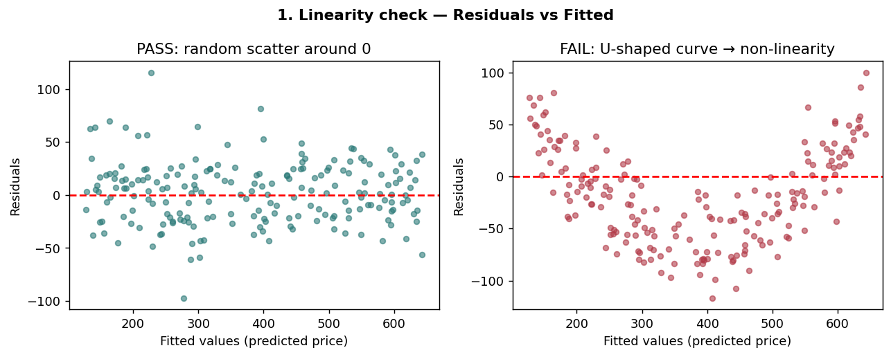
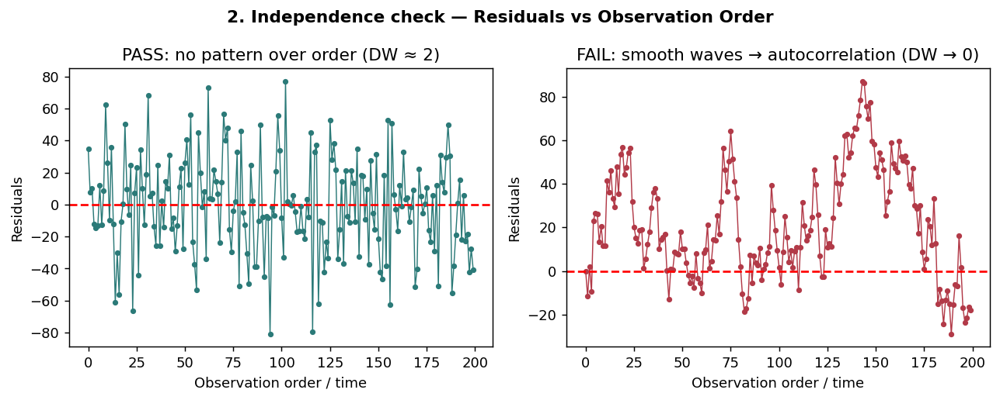
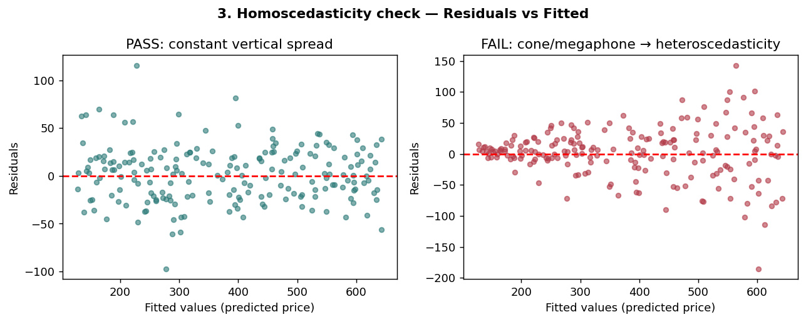
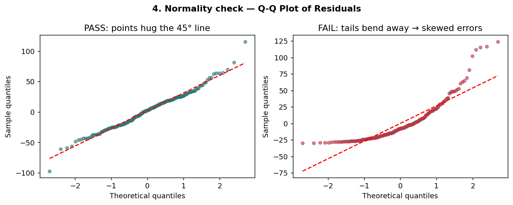
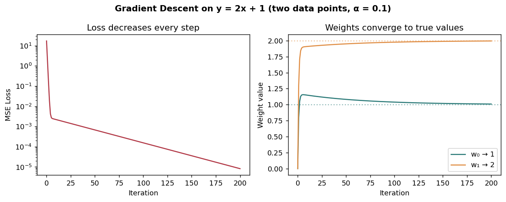
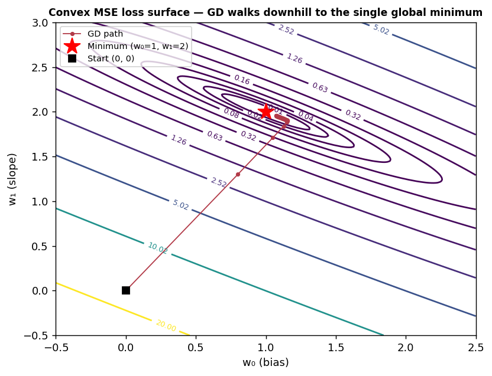

# Linear Regression — Interview Notes (Mid-Level Data Scientist)

A complete, phase-by-phase prep sheet. Structure follows how interviews actually progress: basics → assumptions → math & optimization → regularization → evaluation → applied scenarios.

## Table of Contents
1. [Phase 1: The Basics](#phase-1-the-basics)
2. [Phase 2: The Core Assumptions](#phase-2-the-core-assumptions)
3. [Phase 3: Math & Optimization](#phase-3-math--optimization)
4. [Phase 4: Overfitting & Regularization](#phase-4-overfitting--regularization)
5. [Phase 5: Evaluation & Metrics](#phase-5-evaluation--metrics)
6. [Phase 6: Applied & Practical Topics](#phase-6-applied--practical-topics)
7. [Comparison Questions](#comparison-questions)
8. [Rapid-Fire Q&A](#rapid-fire-qa)
9. [Summary Checklist](#summary-checklist)

---

## Phase 1: The Basics

### Q: What is Linear Regression in simple terms?
> "Linear regression is a supervised learning technique used to predict a continuous numeric value — like price, sales, or temperature — from one or more input features. It assumes the relationship between inputs and output is roughly a straight line (a plane in higher dimensions). The model learns a weight for each feature that tells us how much the output changes when that feature changes, plus a bias term as a baseline. We fit the model by finding weights that make predictions as close as possible to actual values in the training data."

**Everyday analogy:** Predicting a house price — the model might learn that every extra square foot adds ~$150 and every extra bedroom adds ~$10,000 on top of a base price. That's exactly what the weights represent.

- **Simple linear regression:** one feature → a straight line.
- **Multiple linear regression:** many features → a hyperplane.

### Q: What is the difference between a dependent and an independent variable?
- **Independent variables (features, predictors, X):** the inputs we control or observe — e.g., house size, bedrooms. Assumed to be measured without error.
- **Dependent variable (target, response, y):** the outcome we predict — e.g., price. Called "dependent" because its value depends on the independent variables. The randomness/noise in the model lives in y, not X.

### The Model Equation

```
y = w₀ + w₁x₁ + w₂x₂ + ... + wₚxₚ + ε
```

Vector form: `ŷ = wᵀx + w₀` (or `ŷ = Xw` with a column of 1s absorbed into X for the bias).

| Term | Meaning |
|---|---|
| w₀ | Bias / intercept — expected y when all features are 0 |
| wᵢ | Weight — expected change in y per unit change in xᵢ, *holding all other features constant* |
| ε | Irreducible random error, assumed ~ N(0, σ²) |
| Residual | eᵢ = yᵢ − ŷᵢ, the observed prediction error for row i |

**Key framing:** Linear regression is linear *in the weights*, not the features. `y = w₀ + w₁x²` is still a linear model.

### Simple Worked Example (know one cold)

Trained model for house price (in $1000s), size in 100s of sq ft:

```
ŷ = 50 + 15·(size) + 10·(bedrooms)
```

Prediction for a 1,200 sq ft (size = 12), 3-bedroom house:

```
ŷ = 50 + 15(12) + 10(3) = 50 + 180 + 30 = 260  →  $260,000
```

If the actual price was $275k, residual = 275 − 260 = 15 ($15k). Training = adjusting w₀, w₁, w₂ to minimize the sum of *squared* residuals across all houses.

**Interpretation soundbite:** "Holding bedrooms fixed, every extra 100 sq ft is associated with a $15k higher predicted price."

### Q: What is the loss function, and why do we square the errors?
**Loss:** Residual Sum of Squares / Mean Squared Error.

```
RSS = Σ(yᵢ − ŷᵢ)²        MSE = RSS / n
```

**Why squared instead of absolute error?**
1. **Differentiable everywhere** — smooth gradient enables calculus-based optimization and a closed-form solution. |error| has a kink at 0.
2. **Statistical justification** — under Gaussian noise, minimizing squared error = Maximum Likelihood Estimation.
3. **Penalizes large errors disproportionately** — an error of 10 costs 100, an error of 2 costs 4. Being off by a lot is much worse than being off a little.
4. **Trade-off** — that same property makes OLS sensitive to outliers; MAE/Huber loss are the robust alternatives.

---

## Phase 2: The Core Assumptions (3 of them look into residuals INE , L feature vs target linearity)

### Q: What are the core assumptions of linear regression? (the "LINE" mnemonic)

| Assumption | Meaning | How to check | Consequence if violated |
|---|---|---|---|
| **L**inearity | Relationship between X and E[y] is linear | Residuals vs fitted plot — should show no pattern | Biased predictions. Fix: polynomial/interaction terms, transformations |
| **I**ndependence | Residual Errors are independent (no autocorrelation) | Durbin–Watson test; domain knowledge (time series, clustered data) | Standard errors wrong → invalid p-values/CIs |
| **N**ormality of residual errors | ε ~ Normal | Q–Q plot, Shapiro–Wilk | Inference unreliable in small samples; predictions still fine. Least critical for large n (CLT) |
| **E**qual variance (Homoscedasticity) | Var(ε) constant across fitted values | Residuals vs fitted (fan/funnel = bad), Breusch–Pagan test | Weights still unbiased, but SEs wrong. Fix: log-transform y, WLS, robust standard errors |

Plus: **no perfect multicollinearity** among predictors.

**Nuance interviewers love:** Violating normality or homoscedasticity does **not** bias the weights — it invalidates the *inference* (standard errors, p-values, CIs). Violating linearity or independence is more serious because it biases predictions themselves.

### Q: How do you actually test each assumption? (worked walkthrough)

**Golden rule: you test assumptions on the residuals, not the raw data.**

**Setup example** — predicting House Price from Square Footage:
- Target (y): house price
- Feature (X): square footage
- Residuals (e): `e = y_actual − y_predicted`

Fit the model, compute residuals, then run the four checks below.

#### 1. Linearity → Residuals vs Fitted plot
- **Pass:** points randomly scattered around the horizontal zero line, no structure.
- **Fail:** a visible curve (e.g., U-shape) → the true relationship is non-linear; add polynomial terms or transform features.

```python
import matplotlib.pyplot as plt

plt.scatter(predictions, residuals)
plt.axhline(y=0, color='r', linestyle='--')
plt.xlabel('Fitted values'); plt.ylabel('Residuals')
plt.title('Residuals vs Fitted (Linearity + Homoscedasticity check)')
```



#### 2. Independence → Durbin–Watson test
- the error terms (residuals) of different observations must be uncorrelated with one another
- Checks whether one residual predicts the next (autocorrelation) — critical for time-series or ordered data.
- **Reading the statistic (ranges 0–4):**
  - ≈ 2.0 → no autocorrelation (ideal)
  - 1.5 – 2.5 → generally acceptable
  - near 0 → strong positive autocorrelation; near 4 → strong negative autocorrelation (both bad)

```python
from statsmodels.stats.stattools import durbin_watson

dw = durbin_watson(residuals)
print(f"Durbin-Watson: {dw:.2f}")   # want ~2
```



#### 3. Homoscedasticity(Equal Variance) → same Residuals vs Fitted plot + Breusch–Pagan
- **Pass:** vertical spread of points stays roughly constant left to right.
- **Fail:** cone/megaphone shape — errors grow with the prediction (e.g., model precise on cheap houses, wild on mansions).
- **Formal test:** Breusch–Pagan; p-value < 0.05 → heteroscedasticity present.

```python
from statsmodels.stats.diagnostic import het_breuschpagan

bp_stat, bp_pvalue, _, _ = het_breuschpagan(residuals, X_with_const)
print(f"Breusch-Pagan p-value: {bp_pvalue:.4f}")   # < 0.05 = assumption violated
```



#### 4. Normality of residuals → Q–Q plot (or histogram)
- **Pass:** points hug the 45° diagonal reference line.
- **Fail:** points curve away sharply at the tails → skewed or heavy-tailed errors. Formal test: Shapiro–Wilk (small samples).

```python
import statsmodels.api as sm

sm.qqplot(residuals, line='45')
plt.title('Normal Q-Q Plot')
```



#### Assumption-testing cheat sheet

| Assumption | Visual tool | Statistical test | What failure looks like |
|---|---|---|---|
| Linearity | Residuals vs Fitted | RESET test | Distinct curve/pattern in residuals |
| Independence | Autocorrelation plot | Durbin–Watson | DW far below 1.5 or far above 2.5 |
| Homoscedasticity | Residuals vs Fitted | Breusch–Pagan | Cone/megaphone shape |
| Normality | Q–Q plot / histogram | Shapiro–Wilk | Points bending away from the 45° line |

**Go-to remedy (great interview soundbite):** transforming the target — e.g., modeling `log(price)` instead of `price` — often fixes linearity, homoscedasticity, and normality *simultaneously*, because it compresses the large values that cause curvature and growing variance.

**End-to-end snippet you can run:**

```python
import numpy as np, statsmodels.api as sm

X = np.random.uniform(500, 4000, 200)            # square footage
y = 50 + 0.15 * X + np.random.normal(0, 30, 200) # price in $1000s

X_const = sm.add_constant(X)
model = sm.OLS(y, X_const).fit()
residuals, predictions = model.resid, model.fittedvalues
# → now run the four checks above on `residuals` and `predictions`
print(model.summary())  # also reports Durbin-Watson automatically
```

### Q: What is multicollinearity, and how does it affect the coefficients?
- **What:** Predictors are highly correlated with each other.
- **Effect on weights:** They become unstable (high variance across resamples), signs can flip, magnitudes inflate, individual p-values become unreliable — the model can't attribute credit between correlated features.
- **Effect on predictions:** Largely unaffected. R² is fine. This asymmetry is the classic follow-up.
- **Detection:**
  - Correlation matrix (only catches pairwise relationships.  in Python's Pandas) and helps you visually spot which specific pairs of variables are overlapping.Cons: It can only detect correlations between pairs of variables. Multicollinearity can still exist when three or more variables work together to create a linear relationship, even if the correlation between any two is low)
  - Best Alternative than Corr is VIF.
  - **VIF:** VIFⱼ = 1 / (1 − Rⱼ²), where Rⱼ² comes from regressing feature j on all other features. Rule of thumb: VIF > 5–10 is a concern.
- **Fixes:** Drop or combine redundant features, PCA, domain-driven selection, or **Ridge regression** (shrinks correlated weights toward each other and stabilizes them).

### Q: How do you detect and fix heteroscedasticity?
- **Detect:** Plot residuals vs fitted values — a fan/funnel shape means variance grows with the prediction. Formal tests: Breusch–Pagan, White test.
- **Fix (in order of practicality):**
  1. **Robust (HC3 / White) standard errors** — weights unchanged, inference corrected. The go-to production answer.
  2. **Log-transform y** — often stabilizes variance when spread grows with magnitude (e.g., prices, incomes).
  3. **Weighted Least Squares** — downweight high-variance observations if the variance structure is known.

---

## Phase 3: Math & Optimization

### Q: What is the closed-form solution (Normal Equation)?
 Normal Equation is a closed-form analytical solution used in linear regression to find the optimal model parameters directly in a single calculation
  ŵ = (XᵀX)⁻¹ Xᵀy
Minimize RSS by setting its gradient with respect to w to zero:

```
∇w RSS = −2Xᵀ(y − Xw) = 0   →   XᵀXw = Xᵀy   →   ŵ = (XᵀX)⁻¹ Xᵀy
```
##  Determinants and Adjugates

The relationship between a matrix, its determinant, and its adjugate is defined by the core formula for the inverse of a matrix $A$:

$$A^{-1} = \frac{1}{\det(A)} \text{adj}(A)$$

---

## 1. Determinant: det(A)
The determinant is a single scalar value calculated from a square matrix. 
* **Purpose:** It reveals if a matrix can be inverted and how it scales geometric space.
* **Singular Property:** If $\det(A) = 0$, the matrix is singular and has no inverse.

### Formula (2 × 2)
For a matrix $A$:
Matrix representation:
```
| a   b |
| c   d |
```
Its determinant is calculated as:
det(A) = ad - bc

### Example
For a matrix $A$:
Matrix representation:
```
| 3   5 |
| 1   4 |
```
calculation:
Matrix representation: 12 - 5 = 7
---
## 2. Adjugate (adj(A))
The adjugate matrix is a matrix built by finding the cofactor of each element and then transposing (flipping) the matrix across its main diagonal.

### Quick Shortcut (2 × 2)
1. Swap the positions of the elements on the main diagonal ($a$ and $d$).
2. Change the signs of the elements on the opposite diagonal ($b$ and $c$).

Visual guide:
```
Original:              Adjugate:
| a   b |             | d    -b |
| c   d |             | -c   a  |
```

### Example
Using our example matrix $A$:
Matrix representation:
```
| 4    -5 |
| -1    3 |
```
---
## 3. Matrix Inversion Step-by-Step
To find the inverse matrix $A^{-1}$, divide the adjugate matrix by the determinant value.

Step representation:
```
A^-1 = (1/7) × | 4   -5 |
               | -1   3 |
```
Final result:
```
| 4/7   -5/7 |
| -1/7   3/7 |
```
---
### Q: When does the Normal Equation fail or become impractical?
1. **XᵀX is singular (non-invertible)** when:
   - Perfect multicollinearity (one feature is an exact linear combination of others — including the dummy variable trap)
   - More features than samples (p > n)
2. **Computational cost:** Matrix inversion is **O(p³)** in the number of features (plus O(np²) to form XᵀX). Fine for hundreds of features; prohibitive for very high-dimensional data.
3. **Fix for singularity:** Ridge regularization — `(XᵀX + λI)` is always invertible for λ > 0.

### Q: How does Gradient Descent optimize the cost function?

### The Mathematical Setup — MSE Loss & Calculus Derivation

**Step 1 — Define the model and the loss.** For simple linear regression `ŷᵢ = w₀ + w₁xᵢ`, the Mean Squared Error as a function of the weights is:

```
L(w₀, w₁) = (1/n) Σᵢ (w₀ + w₁xᵢ − yᵢ)²
```

The data (xᵢ, yᵢ) is fixed; **the weights are the variables**. L is a smooth bowl-shaped (convex) surface over (w₀, w₁), and "training" means finding the bottom of the bowl.

**Step 2 — Derive the gradients (chain rule).** Let the per-point error be `eᵢ = w₀ + w₁xᵢ − yᵢ`. Then L = (1/n)Σeᵢ², and by the chain rule ∂(eᵢ²)/∂w = 2eᵢ · ∂eᵢ/∂w:

```
∂eᵢ/∂w₁ = xᵢ          ∂eᵢ/∂w₀ = 1

∂L/∂w₁ = (2/n) Σ eᵢ·xᵢ = (2/n) Σ (ŷᵢ − yᵢ)·xᵢ
∂L/∂w₀ = (2/n) Σ eᵢ    = (2/n) Σ (ŷᵢ − yᵢ)
```

**Intuition:** each gradient is an error-weighted signal. If predictions are too low (eᵢ < 0), the gradients are negative, and the update rule `w := w − α·gradient` *increases* the weights. The gradient always points uphill; we step in the opposite direction.

**Step 3 — Two roads to the minimum:**
- **Closed form:** set both derivatives to zero and solve → the Normal Equation.
- **Iterative:** gradient descent — repeat `w := w − α·∂L/∂w` until the gradients vanish.

Both roads end at the same point because MSE is convex: the only place where the gradient is zero is the single global minimum.

### Q: How does Gradient Descent reach the solution? (full worked example)

**Data:** (x=1, y=3), (x=2, y=5). True line: y = 2x + 1, so the answer we should recover is **w₀ = 1, w₁ = 2**. Init w₀ = w₁ = 0, α = 0.1.

**Iteration 1 by hand:**
1. **Predict:** ŷ₁ = 0, ŷ₂ = 0 → errors (ŷ − y): −3, −5. Loss = (9 + 25)/2 = **17.0**
2. **Gradients:** ∂L/∂w₁ = (2/2)[(−3)(1) + (−5)(2)] = **−13**;  ∂L/∂w₀ = (2/2)[(−3) + (−5)] = **−8**
3. **Update:** w₁ = 0 − 0.1(−13) = **1.3**;  w₀ = 0 − 0.1(−8) = **0.8**

**Iteration 2 by hand:**
1. **Predict:** ŷ₁ = 0.8 + 1.3(1) = 2.1 (error −0.9); ŷ₂ = 0.8 + 1.3(2) = 3.4 (error −1.6). Loss = (0.81 + 2.56)/2 = **1.685**
2. **Gradients:** ∂L/∂w₁ = (−0.9)(1) + (−1.6)(2) = **−4.1**;  ∂L/∂w₀ = (−0.9) + (−1.6) = **−2.5**
3. **Update:** w₁ = 1.3 + 0.41 = **1.71**;  w₀ = 0.8 + 0.25 = **1.05**

**Approach to the final solution** (running the same loop). Loss at each step = (e₁² + e₂²)/2, where eᵢ = ŷᵢ − yᵢ:

| Iteration | w₀ | w₁ | Errors (e₁, e₂) | Loss calculation | MSE Loss |
|---|---|---|---|---|---|
| 0 (start) | 0.000 | 0.000 | (−3, −5) | ((−3)² + (−5)²)/2 = (9 + 25)/2 | 17.000 |
| 1 | 0.800 | 1.300 | (−0.9, −1.6) | (0.81 + 2.56)/2 | 1.685 |
| 2 | 1.050 | 1.710 | (−0.24, −0.53) | (0.0576 + 0.2809)/2 | 0.169 |
| 3 | 1.127 | 1.840 | (−0.033, −0.193) | (0.0011 + 0.0372)/2 | 0.019 |
| 5 | 1.155 | 1.896 | (0.051, −0.053) | (0.0026 + 0.0028)/2 | 0.0027 |
| 50 | 1.082 | 1.949 | (0.031, −0.019) | (0.0010 + 0.0004)/2 | 0.0007 |
| 200 | 1.009 | 1.994 | (0.003, −0.002) | (0.00001 + 0.00000)/2 | ~0.00001 |

Reading one row end-to-end (iteration 1): with w₀ = 0.8, w₁ = 1.3, predictions are ŷ₁ = 0.8 + 1.3(1) = 2.1 and ŷ₂ = 0.8 + 1.3(2) = 3.4; errors are 2.1 − 3 = −0.9 and 3.4 − 5 = −1.6; squaring and averaging gives (0.81 + 2.56)/2 = 1.685.

Loss collapses by ~1000× in the first 3 iterations, then the weights glide slowly into (1, 2). Note w₀ briefly *overshoots* to ~1.15 before settling back — the two weights interact, and the path curves through the loss valley rather than moving in a straight line:





**Sanity check with the closed form.** Setting the two gradients to zero gives the normal equations for this dataset:

```
Σeᵢ = 0:    2w₀ + 3w₁ = 8        (from n·w₀ + w₁Σx = Σy)
Σeᵢxᵢ = 0:  3w₀ + 5w₁ = 13       (from w₀Σx + w₁Σx² = Σxy)
```

Solving: w₁ = 2, w₀ = 1 — exactly where gradient descent is heading. **This is the interview punchline: the Normal Equation just solves "gradient = 0" directly in one algebraic step, while GD walks there incrementally.**

**GD vs Normal Equation — when to choose which:**

| | Normal Equation | Gradient Descent |
|---|---|---|
| Complexity | O(p³) inversion | ~O(k·n·p) for k iterations |
| Feature scaling | Not required | Strongly recommended (elongated loss surface → zig-zag) |
| Hyperparameters | None | Learning rate, iterations |
| Large p (10k+ features) | Impractical | Works |
| Regularized / online / streaming | Ridge only | Natural fit (SGD) |

**GD talking points:**
- **Batch vs SGD vs mini-batch:** batch uses all n samples per update (stable, slow); SGD uses one (noisy, fast); mini-batch is the practical default.
- **Learning rate:** too small → slow; too large → oscillation or divergence.
- **Convexity:** MSE for linear regression is convex — one global minimum, so GD (with sane α) converges to the same solution as OLS.
- **Stopping criteria:** max iterations, gradient norm threshold, or validation-loss plateau.

---

## Phase 4: Overfitting & Regularization

### Q: What is the Bias–Variance Tradeoff?

```
Expected test error = Bias² + Variance + Irreducible error
```

- **Bias:** error from wrong model assumptions (underfitting) — e.g., fitting a line to a curved relationship.
- **Variance:** sensitivity to the particular training sample (overfitting) — e.g., a degree-15 polynomial that changes wildly with each resample.
- Plain OLS is unbiased (under its assumptions) but can have high variance with many or correlated features.
- **Regularization deliberately adds a little bias to buy a large variance reduction → lower total test error.**

### Q: What is the difference between Ridge (L2) and Lasso (L1)?

| Method | Penalty added to RSS | Behavior |
|---|---|---|
| **Ridge (L2)** | λ Σwⱼ² | Shrinks weights toward zero, never exactly zero. Handles multicollinearity well (splits weight among correlated features). Closed form: ŵ = (XᵀX + λI)⁻¹Xᵀy — always invertible |
| **Lasso (L1)** | λ Σ\|wⱼ\| | Drives some weights exactly to zero → built-in feature selection. Unstable with correlated features (arbitrarily picks one) |
| **Elastic Net** | αλΣ\|wⱼ\| + (1−α)λΣwⱼ² | Best of both; preferred with correlated features when you still want sparsity |

### Q: How does Lasso perform feature selection? (geometric intuition)
Regularization can be viewed as minimizing RSS subject to a constraint on weight size. **Lasso's constraint region is a diamond** (in 2D) — it has corners *on the axes*. The elliptical RSS contours usually first touch the constraint region at a corner, where one weight is exactly zero. **Ridge's constraint region is a circle** — no corners, so the touch point almost never lands exactly on an axis; weights shrink but stay nonzero.

**Additional key points:**
- **Always standardize features first** — penalties are scale-sensitive.
- The bias term w₀ is typically **not** penalized.
- λ is chosen via cross-validation (larger λ = more shrinkage = simpler model).
- **Bayesian view (bonus points):** Ridge = Gaussian prior on w; Lasso = Laplace prior; OLS = flat prior.

---

## Phase 5: Evaluation & Metrics

### Q: What is the difference between R² and Adjusted R²?

| Metric | Formula | Notes |
|---|---|---|
| **R²** | 1 − RSS/TSS | Proportion of variance in y explained by the model |
| **Adjusted R²** | 1 − (1−R²)(n−1)/(n−p−1) | X_test.shape()->n,p.Penalizes model size p; only rises if a new feature improves fit more than chance |

### Q: Why can't you use R² when adding 50 new features? (Best value 1.0 for both)
The reason you cannot rely on standard **R²** (the Coefficient of Determination) when adding 50 new features is that **R²** is mathematically incapable of decreasing when you add variables, even if those variables are complete garbage, random noise, or irrelevant column data.
**Standard **R²** measures how much of the variance in your target variable y is explained by your model features x**. When you dump 50 new features into an Ordinary Least Squares (OLS) linear regression model, you give the model 50 new mathematical levers to pull.
**Solution**:To prevent this trap,switch from standard training **R²** to metrics that actively penalize model complexity:Adjusted **R²**

-How it works: It penalizes the score every time you add a feature. If a new feature does not reduce the model's error by an amount large enough to "pay" for its added complexity, the Adjusted **R²** will actually decrease.

When evaluating a model's final summary, look at the relationship between the two numbers:Perfect (But Suspicious):**R²**| Adjusted **R²** = 1.0 )Meaning: Math is perfect, but look for a bug or data leakage immediately.
Great & Healthy (The Real-World "Best"): **R²**= 0.85 | Adjusted **R²** = 0.84 Meaning: The model explains 85% of the variance, and the features used are highly efficient and necessary.
Overfitted (Bad):**R²** = 0.85) | Adjusted **R²**= 0.40 Meaning: The standard **R²** looks great, but the massive drop in Adjusted **R²** proves the model is stuffed with useless features that are ruining its ability to generalize.

**Trap question:** "R² is 0.95 — is the model good?" Not necessarily: overfitting, data/target leakage, spurious correlation, or a trending time series can all inflate it. Always verify out-of-sample.

### Q: When would you prefer MAE over RMSE?
- **MAE** when outliers are present and you don't want them to dominate the metric, or when all errors cost the business roughly linearly (e.g., delivery-time error).
- **RMSE** when large errors are disproportionately costly and you want the model punished for them; also in the same units as y and aligned with the squared-error training loss.
- Rule of thumb: RMSE ≥ MAE always; a large gap between them signals outliers/heavy-tailed errors.

### Full metric table

| Metric | Idea | Notes |
|---|---|---|
| R² | 1 − RSS/TSS | Never decreases with more features; **can be negative on test data** (worse than predicting the mean) |
| Adjusted R² | Penalizes p | For comparing models with different feature counts |
| MSE / RMSE | Squared error / its root | RMSE in units of y; outlier-sensitive |
| MAE | Absolute error | Robust; not differentiable at 0 |
| MAPE | % error | Interpretable; explodes when y ≈ 0 |
| AIC / BIC | Likelihood + complexity penalty | BIC penalizes complexity harder |

### Inference on weights (statistical evaluation)
- t-statistic = ŵⱼ / SE(ŵⱼ) → p-value for H₀: wⱼ = 0; 95% CI ≈ ŵⱼ ± 1.96·SE.
- **F-test:** is the whole model better than intercept-only?
- Statistical significance ≠ practical significance — with huge n, tiny effects become "significant."
- **Correlation ≠ causation:** weights are causal only under strong assumptions (no confounders / randomization).

---

## Phase 6: Applied & Practical Topics

**Categorical features:** One-hot encode; drop one level to avoid the **dummy variable trap** (perfect collinearity with the intercept).

**Outliers & influential points:** Outlier ≠ influential. **Leverage** = unusual X values; **influence** (Cook's distance) = actual effect on the fit. Robust alternatives: Huber loss, RANSAC, quantile regression.

**Interpreting log transforms:**
- log(y) ~ x: 1-unit increase in x → ~(100·w)% change in y
- y ~ log(x): 1% increase in x → w/100 change in y
- log–log: w is an **elasticity** (1% change in x → w% change in y)

**Feature scaling:** Not required for OLS correctness — only for gradient descent convergence and regularization fairness. Standardized weights allow rough feature-importance comparison.

**p > n:** No unique OLS solution; use regularization or dimensionality reduction.

---

## Comparison Questions

**Linear vs Logistic regression:** LR predicts continuous y with identity link and squared-error loss; logistic predicts binary y with logit link and log-loss (MLE). Both are GLMs. Why not OLS on 0/1 targets? Predictions escape [0,1], errors are heteroscedastic, and squared error is the wrong loss for probabilities.

**Linear regression vs tree-based models (XGBoost etc.):** Linear = interpretable, extrapolates beyond the training range, needs manual feature engineering for non-linearity, strong on small data with linear signal. Trees = capture non-linearities and interactions automatically, robust to outliers/scaling, but cannot extrapolate and are less interpretable. Good answer: "Regularized linear regression as a fast interpretable baseline, then compare against gradient boosting."

**MLE vs OLS:** Identical weight estimates under Gaussian errors; MLE additionally estimates σ².

---

## Rapid-Fire Q&A

**1. Derive the normal equation.**
∇w[(y − Xw)ᵀ(y − Xw)] = −2Xᵀ(y − Xw) = 0 → XᵀXw = Xᵀy → ŵ = (XᵀX)⁻¹Xᵀy.

**2. Why can adding a feature never decrease training R²?**
OLS optimizes over a strictly larger hypothesis space; at worst it sets the new weight to reproduce the old fit, so RSS can only stay equal or fall.

**3. What happens if you duplicate a feature exactly?**
XᵀX becomes singular → no unique OLS solution (infinitely many weight splits give identical predictions). Ridge resolves it by splitting the weight equally; Lasso arbitrarily zeroes one copy.

**4. When prefer MAE over RMSE?**
Outlier-heavy data or linear business cost of error; RMSE when large misses are disproportionately expensive.

**5. Residuals show a funnel shape — meaning and fix?**
Heteroscedasticity: error variance grows with fitted values. Fix: robust standard errors, log-transform y, or WLS. Weights remain unbiased; only inference was broken.

**6. Interpreting a weight when features are standardized?**
"A one-standard-deviation increase in xⱼ is associated with a wⱼ change in y (or in SDs of y if y is standardized too), holding others constant."

**7. Ridge vs Lasso for a non-technical stakeholder?**
"Both stop the model from over-trusting any single input. Ridge turns every input's influence down a bit, like lowering all volume sliders. Lasso mutes the unimportant inputs entirely, leaving a shorter list of factors that matter."

**8. Train R² 0.9, test R² 0.2 — debugging steps?**
Check for target/data leakage; verify the train/test split (temporal data needs a time-based split); look for distribution shift between sets; check model complexity vs data size (overfit → regularize, simplify, get more data); confirm preprocessing was fit on train only.

**9. Why might a weight's sign contradict domain intuition?**
Multicollinearity (credit shifted to a correlated feature), omitted confounders, or Simpson's paradox (aggregation reversing a within-group relationship).

**10. Parametric or non-parametric?**
Parametric — a fixed number of parameters (p + 1) regardless of dataset size.

---

## Summary Checklist

Before the interview, confirm you can answer yes to all five:

1. **Can I state the 4 assumptions (LINE) and how to test each?** → Residuals vs Fitted (linearity + homoscedasticity), Durbin–Watson ≈ 2 (independence), Q–Q plot (normality), Breusch–Pagan (formal heteroscedasticity test); and I know which violations bias weights vs. merely break inference.
2. **Can I write the Normal Equation from memory?** → ŵ = (XᵀX)⁻¹Xᵀy, derived by zeroing the RSS gradient.
3. **Do I know when to choose Gradient Descent over the Normal Equation?** → p very large (O(p³) inversion too costly), XᵀX singular, streaming/online data, or non-closed-form regularizers like Lasso.
4. **Can I explain how L1 and L2 protect a model?** → Both trade a little bias for a big variance cut; L2 shrinks all weights (stabilizes collinearity), L1 zeroes some (feature selection), diamond-vs-circle geometry explains why.
5. **Can I explain why Adjusted R² is safer than R²?** → R² never falls when features are added, even noise; Adjusted R² charges a complexity penalty so only genuinely useful features raise it.

---

## One-Minute Whiteboard Summary

Model ŷ = Xw, fit by minimizing RSS; closed form ŵ = (XᵀX)⁻¹Xᵀy or gradient descent when p is large or XᵀX is singular. Assumptions: linearity, independent errors, homoscedasticity, normal errors (for inference), no perfect collinearity — diagnose with residual plots, Q–Q, VIF, Cook's distance. Evaluate out-of-sample with RMSE/MAE; compare models with Adjusted R²/AIC. Control overfitting and collinearity with Ridge/Lasso/Elastic Net on standardized features, λ tuned by CV. Remember: unbiased weights can coexist with broken inference, and correlation ≠ causation.
